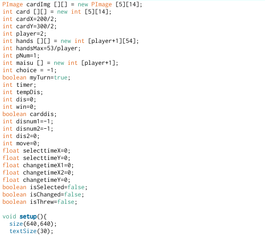
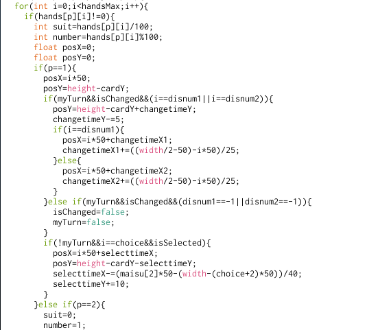

# 初級編: Unreadableババ抜きを掃除する

---

## 目次

1. [Unreadableババ抜きを見る](#1)
1. [BADCODEの定義](#2)
1. [可読性を高める](#3)
    1. [表面上の改善](#3-1)
    1. [ifの並び順](#3-2)
    1. [ファイルによる分割](#3-3)
    1. [変数で分割する](#3-4)
    1. [名前で説明する](#3-5)
    1. [コメントで説明する](#3-6)
    1. [break, continue, returnで早く返す](#3-7)
    1. [無駄を削除する](#3-8)
    1. [変数のスコープを縮める](#3-9)
    1. [メソッドによる分割](#3-10)
    1. [TIPS](#3-11)
1. [掃除を始める](#4)
    1. [掃除の前に…](#4-1)
    1. [掃除の流れ](#4-2)
    1. [課題](#4-3)
    1. [プログラム解説](#4-4)

---

## <a name=1>Unreadableババ抜きを見る</a>

[Download](./contents/beginner/Unreadable_Babanuki.zip)

---

## <a name=2>BADCODEの定義</a>
- 詰まったコード (空白のないコード)
- 一行が長い、{}内が長い
- 解読できない
- コメントが少なすぎる/多すぎる
- 文字がインデントで右側に寄りすぎている
- グローバル変数が多すぎる
- 3次以上の配列を使っている

---

## <a name=3>可読性を高める</a>

---

### <a name=3-1>表面上の改善</a> (★☆☆)

#### スペースを挿入する箇所
- 算術演算子以外の演算子の前後 (`=`, `>`, `==`, `!=` ...)
- `,`の後
- (ここからは好み)
- [], <>の後
- if, for, whileの後
- 算術演算子の前後
- {}の前後
- ( hoge.fuga() ) (カッコが被るとき)

~~~processing
/*---BEFORE---*/
int[]array=[1,2,3,4];
int maxNum=array[0];
for(int i=0;i<array.length;i++){
    if(maxNum<array[i]){
        maxNum=array[i];
    }
}

/*---AFTER---*/
int[] array = [1, 2, 3, 4];
int maxNum = array[0];
for (int i = 0; i < array.length; i++) {
    if (maxNum < array[i]) {
        maxNum = array[i];
    }
}
~~~

#### 空行
- メソッドの前後
- 区切りをつけたいとき

#### インデント下げ
- `{` の次の行

---

### <a name=3-2>ifの並び順</a> (★☆☆)
- 定数を右側に

~~~processing
if (max > 10) ...

if (posX > maxX) ...
~~~

---

### <a name=3-3>ファイルによる分割</a> (★☆☆)
- 役割ごとに分ける
- `setup()` と `draw()` は `main.pde`、`key`, `mouse`関係は `input.pde` など
- 本来は全てクラス化させることが望ましい

---

### <a name=3-4>変数で分割する</a> (★☆☆)
- 変数は式を分割する
- 変数は行為を説明する道具

~~~processing
/*---BEFORE---*/
if ( squares.get( squares.size()-1 ).getValue() == 0 ) ...

/*---AFTER---*/
Square lastSquare = squares.get( squares.size()-1 );
if (lastSquare.getValue() == 0) ...
~~~

~~~processing
/*---BEFORE---*/
if (leftPosition < mouseX && rightPosition >= mouseX) ...

/*---AFTER---*/
boolean inRange = leftPosition < mouseX && rightPosition >= mouseX;
if (inRange) ...
~~~

---

### <a name=3-5>名前で説明する</a> (★★★)
- 名前付けはプログラミングで一番悩む作業
- 名前に使う単語の語彙は経験による部分が大きい
- ただ慣習や伝わるコツがある
- 参考
    - [プログラミングでよく使う英単語のまとめ](http://qiita.com/Ted-HM/items/7dde25dcffae4cdc7923)
    - [うまくメソッド名を付けるための参考情報](http://qiita.com/KeithYokoma/items/2193cf79ba76563e3db6)

#### 名前付けの慣習
- キャメルケース
    - `drawImage`
    - 単語の先頭を大文字から始める (最初は小文字)
- スネークケース
    - `draw_image`
    - 単語の間に `_` を使う
- 好みでどちらかに従う
- クラスは先頭は大文字から、変数やメソッドは小文字から
- 定数は全て大文字、必ずスネークケース

#### コツ
- 分かりづらい省略をしない
    - `string` -> `str`, `number` -> `num` ぐらいは分かるが
    - `score` -> `sc`, `background` -> `bg` はやめよう
- グローバル変数は長く、ローカル変数は短く
    - ローカルとグローバル変数で重複するのを防ぐ
- 一文字の変数は使わない (for, whileの`i`, `j`などを除く)
- 名前に形容詞をつける
    - `x`, `y`, `size`, `number` だけでは分からない
- 意味を成さない単語を使わない
    - `flag`, `switch`, `temp`, `aaa`など

    ~~~processing
    /*---BEFORE---*/
    boolean drawingFlag = false;    //boolean型ならflagなのは自明

    /*---AFTER---*/
    boolean drawing = false;
    ~~~

- (ローマ字を使わない)
    - ローマ字否定派と容認派がいる
    - ほとんどの言語は英語でできているので、個人的には否定派

---

### <a name=3-6>コメントで説明する</a> (★★☆)
- コメントはコードの補助的に説明する方法
- コメントは多すぎても少なすぎてもいけない
    - コメントしなくても分かるようなことは書かない
- 用途
    - メソッド、メソッドの引数、クラスの説明
    - 分かりづらい複雑な処理の説明
    - 既定値の説明

    ~~~processing
    int MAX_LENGTH = 2;  //なんで2なのか書く
    ~~~

    - 欠陥の説明 (～～のときバグが発生する)

---

### <a name=3-7>break, continue, returnで早く返す</a> (★★☆)
- for, while文を途中で抜けるのが`break`、スキップして次のループに行くのが`continue`
- メソッド内で複数の`return`を使う

~~~processing
/*---BEFORE---*/
for (int i = 0; i < chains.size(); i++) {
    int chain = chains.get(i);
    if (chain == null) {
        //例外処理
        emptyCounter++;
    } else {
        //通常処理
        ...
    }
}

/*---AFTER---*/
for (int i = 0; i < chains.size(); i++) {
    int chain = chains.get(i);
    if (chain == null) {    //例外なら早く次にスキップさせる
        emptyCounter++;
        continue;
    }

    ...     //通常処理のネストが下がる
}
~~~

~~~processing
/*---BEFORE---*/
int compare(int n, int m) {
    int r = -1;
    if(n >= m)
        r = 0;
    if(n > m)
        r = 1;
    return r;
}

/*---AFTER---*/
int compare(int n, int m) {
    if (n > m) return 1;
    if (n < m) return -1;
    return 0;   //(n == m)のとき
}
~~~

---

### <a name=3-8>無駄を削除する</a> (★★★)
- コメントアウトしたコードを削除する
- 無駄な処理を削除する

---

### <a name=3-9>変数のスコープを縮める</a> (★★★)
- 変数のスコープ: その変数が使える範囲

~~~processing
int total = 0;  //totalのスコープ開始
...
for (int i = 0; i <= 10; i++) {
    int squaredNum = i*i;   //squaredNumのスコープ開始
    total += squaredNum;    //squaredNumのスコープ終了
}
...
println(total); //totalのスコープ終了
~~~

- グローバル変数だらけの例

- スコープを縮める例

~~~processing
/*---BEFORE---*/
int maxNum = points[0][0];
...
for (int j = 0; j < points.length; j++) {
    for (int i = 0; i < points[0].length; i++) {
        int point = points[j][i];
        if (point > maxNum) {
            maxNum = point;
        }
    }
    
    if (maxNum > 10) {
        ...
    }
}
//ここでもmaxNumは使える

/*---AFTER---*/
...
for (int j = 0; j < points.length; j++) {
    int maxNum = points[0][0];

    for (int i = 0; i < points[0].length; i++) {
        int point = points[j][i];
        if (point > maxNum) {
            maxNum = point;
        }
    }

    if (maxNum > 10) {
        ...
    }
}
//ここではmaxNumは使えない
~~~

- 変数のスコープを縮めると
    - 変数の宣言と使用が近くなるので分かりやすい
    - 変数を間違って書き換えにくくなる
- グローバル変数は全てメインファイルの先頭に
    - メソッドとメソッドの間はNG 

---

### <a name=3-10>メソッドによる分割</a> (★★☆)
- メソッドはコードを分割する箱
    - 結果的にネストが浅くなる
- メソッド化する = その処理を名前で説明する

~~~processing
/*---BEFORE---*/
void draw() {
    background(255);
    ...
    stroke(0);
    for (int i = 1; i < 8; i++){
        line(i*100, 0, i*100, height);
        line(0, i*100, width, i*100);
    }
    ...
}

/*---AFTER---*/
void draw() {
    background(255);
    ...
    drawLines();
    ...
}

//メソッド化と同時に処理の説明をする
void drawLines() {
    stroke(0);
    for (int i = 1; i < 8; i++){
        line(i*100, 0, i*100, height);
        line(0, i*100, width, i*100);
    }
}
~~~

- メソッド化が必要なとき
    - `{}`の中が50行を超える
    - ネストが4[マトリョーシカ](https://ja.wikipedia.org/wiki/マトリョーシカ人形)以上になる
    - 似たような処理がある
- メソッドを使うべきありがちな状況
    - `setup()`, `draw()`, `keyPressed()` 内が長すぎる
    - 読者への怒濤のforIf攻撃
    - ifの条件が長い

#### forIf攻撃

#### メソッドの基本

1. 何かを与えたら何かを返してくる
    - インプット: 引数
    - アウトプット: 返り値
    - 返り値なし(void)、引数なしの時はグローバル変数を処理している可能性が高い
        - ローカル変数やクラスで変数のスコープを縮める
1. 1メソッド1処理
    - 複数のことをやらない

参考: [ネストの深さは闇の深さ](http://qiita.com/Mic-U/items/1ec901864d4ab11c8d6f)

---

### <a name=3-11>TIPS</a>

---

### ifからswitchに変える
- 同じ変数の条件分岐をする場合、switch文を使うと分かりやすくなる

~~~processing
/*---BEFORE---*/
void keyPressed() {
    if (key == 'a') {
        //処理A
    } else if (key == 'b') {
        //処理B
    } else {
        //処理C
    }
}

/*---AFTER---*/
void keyPressed() {
    switch(key) {
        case 'a':
            //処理A
            break;
        case 'b':
            //処理B
            break;
        default:
            //処理C
    }
}
~~~

#### switchの注意

- ifと違い、`==`(等価)しか判定できない
- `null`は条件に指定できない
- `break`をしないと次の`case`に行ってしまう
    - `break`しない記述は分かりづらいためやめよう

---

### {}の省略 (場合による)
- {}内が一行の場合、{}を省略できる
- 好みの部分が大きい

~~~processing
/*---BEFORE---*/
for (int i = 0; i < array.length; i++) {
    if (array[i] == 0) {
        continue;
    }

    ...
}

/*---AFTER---*/
for (int i = 0; i < array.length; i++) {
    if (array[i] == 0) continue;

    ...
}
~~~

#### 注意

- elseを使っているときはやめよう

~~~processing
//BADCODE
for (int i = 0; i < array.length; i++) {
    if (array[i] == 0) println("zero");
    else if (array[i] > 0) println("plus");
    else println("minus");
}
~~~

---

### final
- 変数にfinalをつけると変更不可、つまり定数になる
- より安全に変数を扱うことができる

    ~~~processing
    final String IP_ADDRESS = "localhost";
    IP_ADDRESS = "192.168.0.1";     //エラー
    ~~~

- オブジェクトの中身は書き換えられてしまう

    ~~~processing
    final String[] ADDRESSES = {
        "192.168.0.1", "192.168.0.5"
    };
    ADDRESSES[0] = "localhost";     //エラーなし
    ~~~

- 定数の配列は列挙型によって実装できる (上級編で扱う)

---

## <a name=4>掃除を始める</a>

---

### <a name=4-1>掃除の前に…</a>

[ババ抜きのルールを確認する](https://ja.wikipedia.org/wiki/ババ抜き)

---

### <a name=4-2>掃除の流れ</a>

1. [表面上の改善](./contents/beginner/readableBabanuki_1.zip)
1. [解読・コメントを挿入](./contents/beginner/readableBabanuki_2.zip)
1. [適切な名前付け](./contents/beginner/readableBabanuki_3.zip)
1. [変数で分割する、スコープを縮める](./contents/beginner/readableBabanuki_4.zip)
1. [メソッド、ファイルで分割する](./contents/beginner/readableBabanuki_5.zip)
1. 諸々

---

### <a name=4-3>課題</a>

#### **[可読性を高める](#/12)を参考にしてババ抜きをリーダブルにする**

- [掃除の流れ](#/28)にサンプルコードを掲載している
    - [2段階目](./contents/beginner/readableBabanuki_2.zip)をダウンロードして、3番目の｢適切な名前付け｣から各自取り組むこと
- サンプルコードは正解ではない 各自読みやすいコードを目指すこと
- クラスなど取り扱ってない項目を使用してもよい
- 構造やアルゴリズムを変えても良い
- 中級編で各自のリーダブルコードを使用する

#### TIPS (随時更新)

- 名前付け
    - 表記を統一する (discard = throw, select = choose)
    - 番号 = number, 数 = count と使い分ける (本来どちらもnumber)
    - あえて冗長に名前付けする (hand = 手札だがhandCardとしてカードであることを示唆する)
    - 名前の置換はProcessingの機能だと不十分なので外部エディタを使うとよい
    - ファイル名も変えて良い
    - 単語の重複を避ける (drawは｢描く｣意味で使用しているのでカードを引く意味の｢draw｣は使わない)
    - 意味の多い単語は避ける (take, makeなど)

---

### <a name=4-4>プログラム解説</a>

#### 構成要素

- カード(トランプ) [card]
    - 53枚 (ジョーカー1枚)
    - マーク [suit]
        - クラブ [club], ダイヤ [diamond], ハート [heart], スペード [spade], ジョーカー [joker]
    - 数字 [number]
        - A, 2, 3, ..., J, Q, K
    - 手札 [hand]
- プレイヤー [player]
    - 2人

#### ゲームの流れ

1. 53枚のカードをシャッフルする [shuffle cards]
2. カードをプレイヤーにそれぞれ配る [deal cards]
    - 片方が26枚、もう片方が27枚になる
3. お互いペアのカードを捨てる [discard cards]
4. 自分は相手の手札からカードを1枚選ぶ [select a card]
5. 選択したカードを引く [draw a card]
6. ペアのカードを捨てる
7. 相手も同様に4～6を行う

#### 終了条件

プレイヤーの1人を除いた全員の手札がなくなる

#### 勝利条件

ゲーム終了時点で手札にジョーカーがない

#### ちなみに…

- 元のソースコードは構造上の問題で相当読みにくい
- 本来構造やアルゴリズムまで改善しないとリーダブルにはならない
- しかし構造やアルゴリズムが完全に理解できなくてもコメントを元に名前付けや分割はできる
- 中級編を受講する人で最後の行程までできなかった人は、サンプルコードを読んで備えておこう
