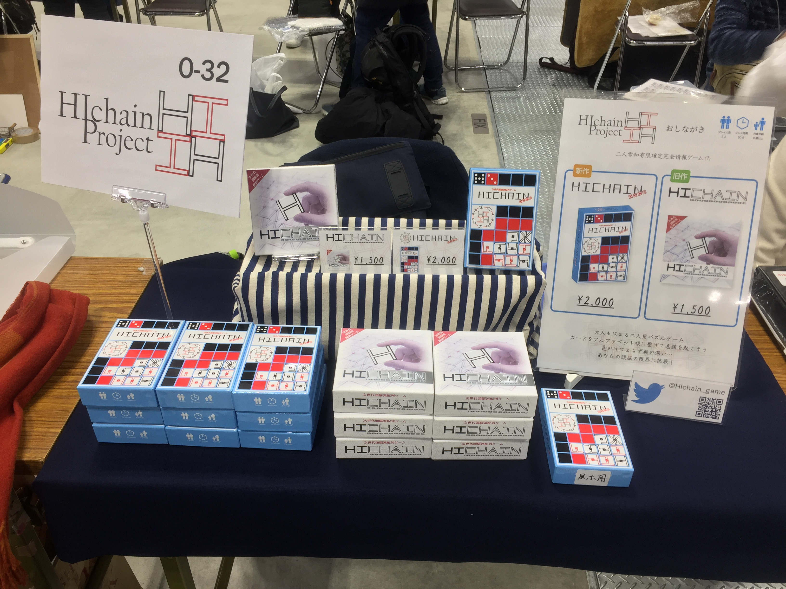
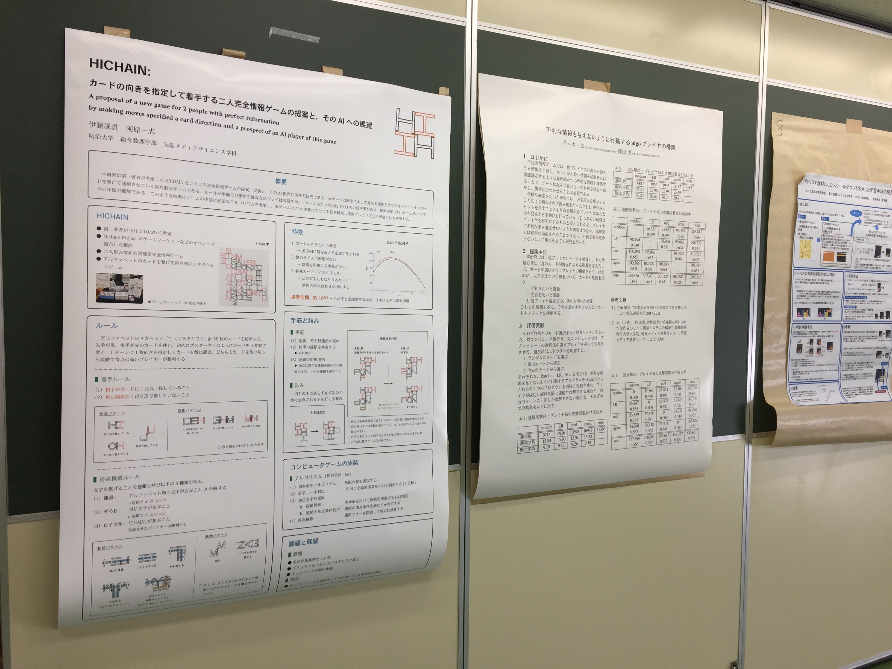
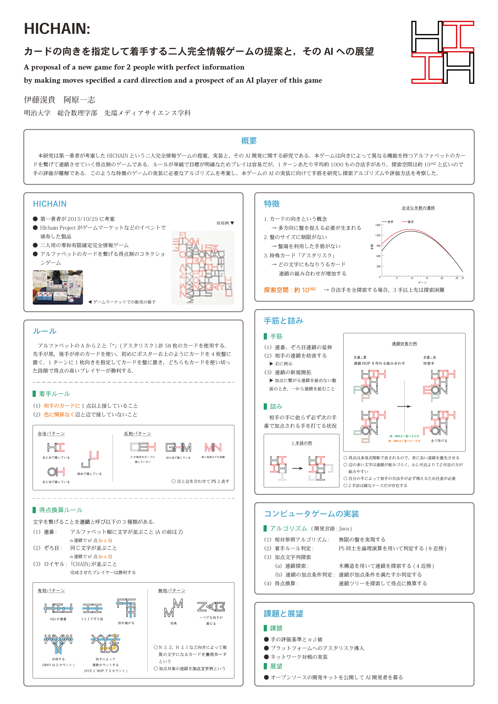

# 阿原研 2017年度末発表会

###  [伊藤滉貴](https://twitter.com/tokiwatools) (B3)

---

## 今年度の研究

- 完全情報ゲーム「HICHAIN」の実装 (-11/12)
	- ゲームプログラミングワークショップ2017 ポスター発表 (11/10-12)
- General Game Playingの勉強 (11/12-)

---

## 研究①: HICHAIN開発

---

### [HICHAIN](http://gamemarket.jp/booth/gm2002/)


|||

### [HICHAIN](http://gamemarket.jp/booth/gm2002/)
- 自身が2015年に考案した完全情報のボードゲーム
- アルファベットのカードを繋げる
- オセロ、将棋のように運要素がない

##### ゲームマーケット2016秋のブース


---

### ポスター発表までの経緯

|||

#### [プロトタイプ版](https://github.com/hichain/HIchain-Prototype)の開発 (2015.12 -)
- 伊藤、海野、池田の共同開発
- 基本ルール、GUIの実装
- [GitHub](https://github.com/hichain/HIchain-Prototype)にてソースコード公開、バイナリ配布


|||

#### ゲームの特徴分析 (2016秋)

- ゲームの複雑さを測るため
- ランダムに手を打つプレイヤー同士を1000回対局させ、打てる手数を測定した
	- チェスより難しく、将棋より簡単 (諸説あり)

##### 合法な手数の遷移


|||

#### [Java版](https://github.com/hichain/HIchain-Prototype)の開発 (2016-12 -)
- 全アルゴリズムの見直し
	- 効率化、拡張性・可読性向上
	- バグの修正
- アスタリスク以外の実装完了
- [GitHub](https://github.com/hichain/HIchain-Prototype)にてソースコード公開

|||

#### 用語、棋譜の表記法を定義 (2017)

- 「ゲームの仕様書」を作成
	- Javaライブラリ公開に向けて規格化
- 用語は[Scrapbox](https://scrapbox.io/hichain)にて公開

#### 手筋、詰みの研究

- AI開発に向けた手の評価のため

---

### GPWポスター発表

- [ゲームプログラミングワークショップ2017](http://www.ipsj.or.jp/sig/gi/gpw/2017/index.html)にてポスター発表
	- 2泊3日 in 箱根
- タイトル「カードの向きを指定して着手する二人完全情報ゲームの提案と，そのAIへの展望」

|||

##### 会場の様子


Note: 会場で1セット販売、ゲムマ訪問者あり

|||

#### ポスター


|||

#### 論文
- [情報処理学会 電子図書館](https://ipsj.ixsq.nii.ac.jp/ej/?action=pages_view_main&active_action=repository_view_main_item_detail&item_id=183840&item_no=1&page_id=13&block_id=8)にて公開

---

### 展望

- AI開発
- ライブラリの公開、開発者募集
- ネットワーク対戦の実装
- 阿原研での研究としての活動は終了
	- サークルとしての開発は継続

---

## 研究②: General Game Playingの勉強

---

### [General Game Playing](http://www.ggp.org/) (GGP)

- 未知のゲームをうまくプレイできるようなAIの設計を目標とする
	- 近年の将棋AIのような特化型AIとは別に、どんなゲームでもそれなりにプレイしてくれる汎用型AIを開発する枠組み
- 世界大会が毎年開催
	- 事前にプレイするゲームの情報が与えられず、その場の限られた時間内でゲームを解析し強いAIを作り出す
- 日本語の情報は非常に少ない
	- [GGPまとめ](https://scrapbox.io/tokiwa/GGP)でメモ公開

Note: GPW17にてGGPに関する発表を聞き知った

---

### Game Description Language (GDL)

- ゲームを記述するための論理型プログラミング言語
	- 非常にレガシーな作り
	- 理論上どんなゲームも再現できる
- ひたすら定義を重ねてゲームのルールを記述する
	- 全ての状態においてルールを定義しなければならない
		- 将棋で3六歩と指した手番では「それ以外の駒は動かない」と定義する
	- 数字、四則演算を使うにはまず1の次は2、2の次は3、と定義する
- 10個ほどの予約語

|||

#### ○×ゲームの一部抜粋

```
(<= (next (cell ?j ?k x))
    (true (cell ?j ?k b))
    (does xplayer (mark ?j ?k))
    (does oplayer (mark ?m ?n))
    (or (distinct ?j ?m) (distinct ?k ?n)))

(<= (next (cell ?m ?n o))
    (true (cell ?m ?n b))
    (does xplayer (mark ?j ?k))
    (does oplayer (mark ?m ?n))
    (or (distinct ?j ?m) (distinct ?k ?n)))

(<= (next (cell ?m ?n b))
    (true (cell ?m ?n b))
    (does xplayer (mark ?m ?n))
    (does oplayer (mark ?m ?n)))
```

---

### 展望

- ゲームをデザインするAIの開発
	- GDLコードの自動生成
	- 「面白い」ゲームの生成
- GDL日本語マニュアルの作成
- その他かじりたいこと
	- N-Queens問題
	- 汎用的な棋譜取りツール
	- 棋譜アート
	- 書きためているソフトウェア、サービス案

---

## GGP共同研究者募集

#### 洋書の和訳、論文の解読など